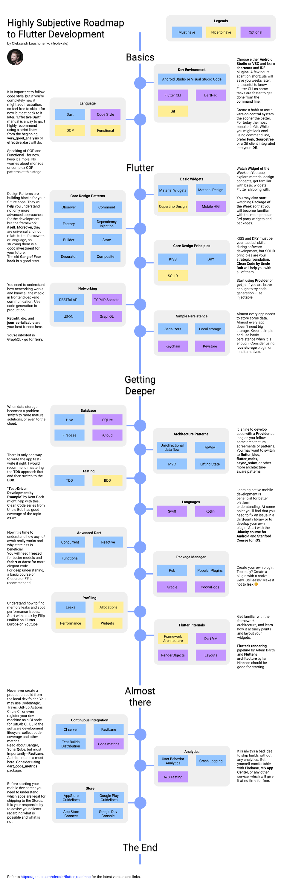

# Flutter Roadmap 

#### Dev Environment
* [Android Studio Shortcuts](https://developer.android.com/studio/intro/keyboard-shortcuts) - Shortcuts to speed up development in Android Studio.
* VSCode Shortcuts for [Windows](https://code.visualstudio.com/shortcuts/keyboard-shortcuts-windows.pdf), [macOS](https://code.visualstudio.com/shortcuts/keyboard-shortcuts-macos.pdf) - Shortcuts to speed up development in VSCode.
* [Flutter CLI](https://docs.flutter.dev/reference/flutter-cli) - Detailed Explanation to all the Flutter CLI commands.
* [DartPad](https://dartpad.dev/) - a tool for creating effective and engaging educational content for Dart and Flutter users.
* [DartPad Tutorial](https://dart.dev/resources/dartpad-best-practices) - Everything DartPad has to offer.
* [Zapp!](https://zapp.run) - free online sandbox environment for building & sharing Dart & Flutter applications, supporting all pub.dev packages, static analysis , embedding, previewing and much more.
* [Interactive Git learning online](https://learngitbranching.js.org) - Learn git commands in an interactive way on `learngitbranching` website.

#### Language
* https://dart.dev/guides/language/language-tour - a brief tour of the Dart language.
* https://dart.dev/guides/language/effective-dart - a guide to writing better Dart code.

#### Basic Widgets
* [Widget of the Week playlist](https://youtube.com/playlist?list=PLjxrf2q8roU23XGwz3Km7sQZFTdB996iG)
* [Package of the Week playlist](https://youtube.com/playlist?list=PLjxrf2q8roU1quF6ny8oFHJ2gBdrYN_AK)
* https://flutter.dev/docs/development/ui/widgets-intro
* http://material.io
* https://developer.apple.com/design/

#### Core Design Patterns
* https://en.wikipedia.org/wiki/Design_Patterns
* [The "Gang of Four" aka "Design Patterns: Elements of Reusable Object-Oriented Software" book](https://en.wikipedia.org/wiki/Design_Patterns)
* [Flutter Design Patterns](https://flutterdesignpatterns.com)

#### Core Design Principles
* https://en.wikipedia.org/wiki/KISS_principle
* https://en.wikipedia.org/wiki/Don%27t_repeat_yourself
* https://en.wikipedia.org/wiki/SOLID
* https://cleancoders.com
* https://pub.dev/packages/provider
* https://pub.dev/packages/get_it
* https://pub.dev/packages/injectable

#### Networking
* https://en.wikipedia.org/wiki/Representational_state_transfer
* https://pub.dev/packages/retrofit
* https://pub.dev/packages/json_serializable

#### Simple Persistence
* https://pub.dev/packages/shared_preferences
* https://pub.dev/packages/flutter_secure_storage

#### Database
* https://pub.dev/packages/isar
* https://pub.dev/packages/sqflite
* https://pub.dev/packages/firebase_storage
* https://pub.dev/packages/cloud_firestore
* https://pub.dev/packages/icloud_storage

#### Architecture
* https://fluttersamples.com
* https://pub.dev/packages/async_redux
* https://pub.dev/packages/flutter_mobx
* https://pub.dev/packages/flutter_bloc

#### Testing
* https://en.wikipedia.org/wiki/Test-driven_development
* https://en.wikipedia.org/wiki/Behavior-driven_development
* https://www.amazon.com/Test-Driven-Development-Kent-Beck/dp/0321146530

#### Languages
* https://www.udacity.com/course/developing-android-apps-with-kotlin--ud9012
* https://cs193p.sites.stanford.edu

#### Dart
* https://pub.dev/packages/freezed
* https://fsharpforfunandprofit.com

#### Package Manager
* [Developing packages & plugins](https://flutter.dev/docs/development/packages-and-plugins/developing-packages) - How to develop packages and plugins for Flutter.
* [CocoaPods](https://cocoapods.org) - package manager for Swift and Objective-C projects.
* [Gradle](https://docs.gradle.org/current/userguide/userguide.html) - build automation system and package manager for Android.

#### Profiling
* https://flutter.dev/docs/perf/rendering/ui-performance
* https://youtu.be/vVg9It7cOfY

#### Flutter Internals
* https://youtu.be/UUfXWzp0-DU
* https://youtu.be/dkyY9WCGMi0
* http://www.cs.cmu.edu/~bam/uicourse/830spring20/05-830-2020-03-23-Lecture-10-Flutter.mp4
* https://mrale.ph/dartvm/

#### Security
* [OWASP MASVS](https://owasp.org/www-project-mobile-app-security/) - Mobile Application Security Verification Standard
* https://pub.dev/packages/freerasp

#### Continuous Integration
* https://fastlane.tools
* https://danger.systems
* https://www.sonarqube.org
* https://codemagic.io/
* https://travis-ci.org

#### Analytics
* https://firebase.google.com/docs/analytics
* https://docs.microsoft.com/en-us/appcenter/analytics/
* https://developer.mixpanel.com/docs/flutter
* https://docs.smartlook.com/docs/sdk/flutter
* https://pub.dev/packages/datadog_flutter_plugin

#### Store
* https://developer.apple.com/app-store/review/guidelines/
* https://play.google.com/about/developer-content-policy/
* https://developer.android.com/distribute/best-practices/launch/launch-checklist

## Contribution
Do not hesitate to add more useful links, or suggest changes to the roadmap. Opinions are highly appreciated!
